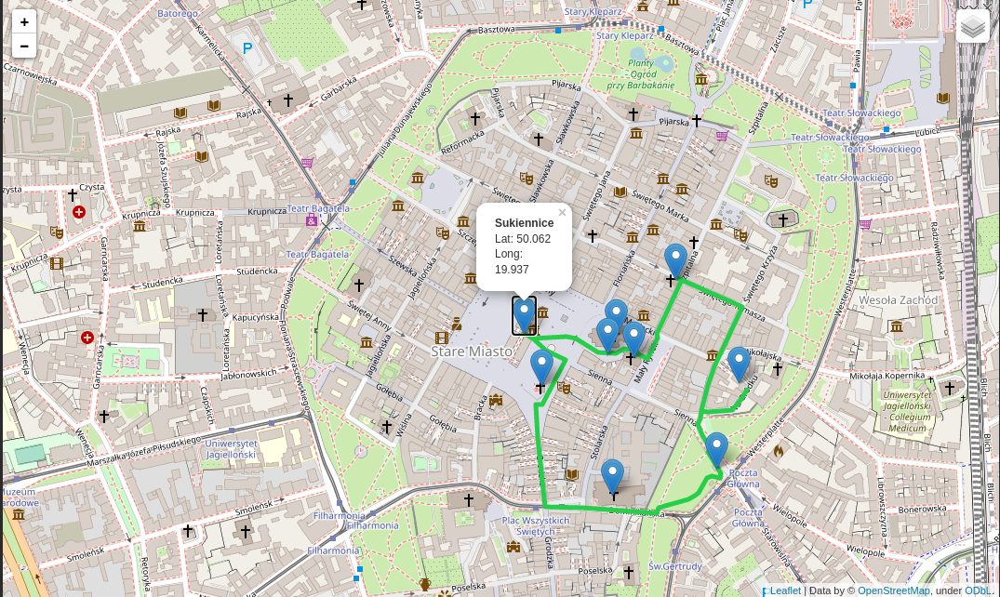

# Runigo APP
Team Pistacchio | Runigo App - your perfect running route

We created Runigo - an application for people who run and travel, be it hiking or jogging. A quick trip on an off-road route close to your hotel? Or how about a visit to the center combined with visiting many monuments? Perhaps you are looking for peace in the mountains? If so, you will love Runigo. Runigo helps you find your perfect running route based on your preferences. After selecting the route length, preferred surface and route type, our algorithm will present you with the best route suggestions. Thanks to us, you will rediscover running and sightseeing. When you complete the route, you will receive a badge with a percentage map of a given city, list of your achievements with the number of interesting objects visited and find out how much you have left. In addition, you will find yourself on the results table where you will compare yourself with other users in similar age and ... weight category. Runigo - all tourist routes on your phone.

# Runigo - all tracks on your phone
We created an app for people that run and travel a lot! After choosing distance, road surface, type of run, our algorithm shows you the best route proposals. Thanks to our app you will discover running from a different perspective

# Use of EU space technologies

Using the collected Galileo positions we will create the most optimal route per user of our application. We will use Galileo because we want better accuracy, especially in places that are difficult to get to (heavily forested areas in the mountains or urbanized areas).
Moreover, thanks to precise user position it is possible to report events on the route (fallen tree, impassable road, closed park after 8:00 PM, closed trail, illegible route marking). Satellite data will be used to track and record the route taken.
Using Sentinels satellite data, we will detect green areas (less urbanized) and assess air quality in the area. 

